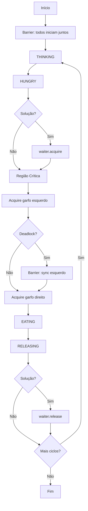

# Arquitetura do Sistema — PhilosophersOS

## Visão Geral

O PhilosophersOS segue arquitetura em camadas, separando domínio (filósofos), sincronização, monitoramento, interface e utilitários.

```text
┌─────────────────────────────────────────────────────────┐
│                    CAMADA DE VIEWS                       │
│  main_menu │ deadlock │ solution │ comparison │ config  │
│            │ architecture │ about                          │
└────────────────────────┬────────────────────────────────┘
                         │
┌────────────────────────▼────────────────────────────────┐
│                    CAMADA DE UI (Rich)                   │
│  theme │ components │ dashboard │ panels │ tables        │
└────────────────────────┬────────────────────────────────┘
                         │
┌────────────────────────▼────────────────────────────────┐
│              CAMADA DE SINCRONIZAÇÃO                     │
│  deadlock_version │ solution_version │ forks             │
└────────────────────────┬────────────────────────────────┘
                         │
┌────────────────────────▼────────────────────────────────┐
│              CAMADA DE DOMÍNIO                           │
│  Philosopher (Thread) │ DiningTable │ PhilosopherState   │
└────────────────────────┬────────────────────────────────┘
                         │
┌────────────────────────▼────────────────────────────────┐
│              CAMADA DE MONITORAMENTO                     │
│  ExecutionMonitor │ DeadlockMonitor │ StatisticsMonitor  │
└─────────────────────────────────────────────────────────┘
```

---

## Componentes Principais

### Filósofos (Threads)

- **Classe:** `Philosopher(threading.Thread)`
- **Quantidade:** Configurável (padrão: 5)
- **Ciclo:** THINKING → HUNGRY → WAITING → EATING → RELEASING

### Garfos (Locks)

- **Classe:** `Fork`
- **Mecanismo:** `threading.Lock` por garfo
- **Quantidade:** Igual ao número de filósofos

### Mesa (Coordenação)

- **Classe:** `DiningTable`
- **Responsabilidades:** Estado compartilhado, estatísticas, barriers, eventos

### Garçom (Semáforo)

- **Mecanismo:** `threading.Semaphore(waiter_limit)`
- **Padrão:** `waiter_limit = num_philosophers - 1`
- **Função:** Limitar filósofos na região crítica

---

## Recursos Compartilhados

| Recurso | Tipo | Proteção |
|---------|------|----------|
| Garfo F0..FN | Recurso físico simulado | `threading.Lock` |
| Estado dos filósofos | Variável compartilhada | `state_lock` |
| Contador de refeições | Variável compartilhada | `statistics.lock` |
| Permissão para comer | Recurso lógico | `threading.Semaphore` |

---

## Fluxo de Execução



---

## Estratégias Implementadas

### Versão Deadlock

- Todos adquirem garfo esquerdo via Barrier
- Tentam garfo direito → espera circular
- Monitor detecta ausência de progresso

### Versão Solução

- Semáforo limita a N-1 filósofos na disputa
- Quebra espera circular
- Execução completa sem bloqueio

---

## Estrutura de Diretórios

```text
src/
├── philosophers/     # Domínio: filósofos, estados, mesa
├── synchronization/  # Versões deadlock/solução, garfos
├── monitors/         # Execução, deadlock, estatísticas
├── views/            # Telas da CLI
├── ui/               # Componentes Rich reutilizáveis
└── utils/            # Config, logger, constantes
```

---

*Documento de arquitetura — PhilosophersOS v1.0.0*
